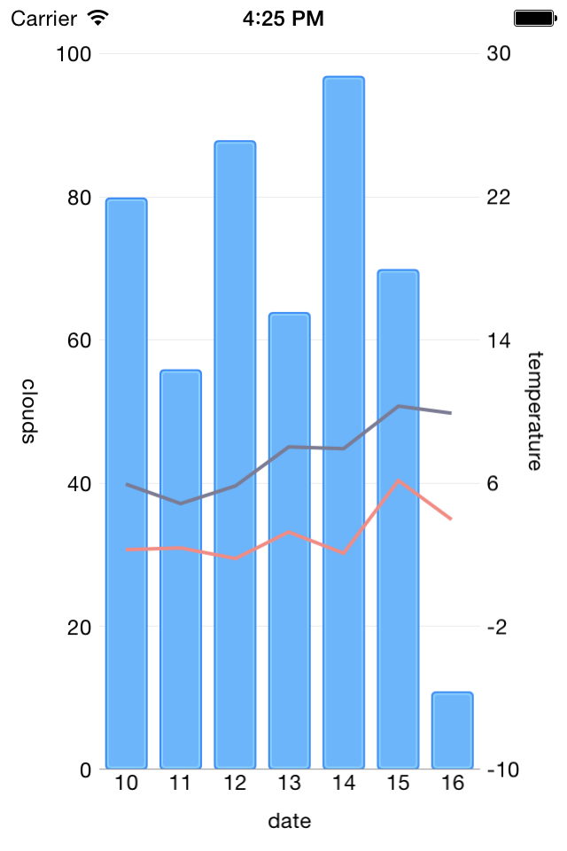

# Chart with DataSource Sample App for NativeScript

This sample project demonstrates how you can create a native iOS application in JavaScript using Telerik UI for iOS and the [NativeScript framework](http://github.com/nativescript/nativescript).

## Showcased features and SDKs

Here is a list of the features that are showcased in the Chart with DataSource sample app:

- Creating UI in XML using the built-in components.
- Accessing native APIs from JavaScript.
- Showing how Telerik UI for iOS can be used with the NativeScript framework.

## Requirements  

The following is a list of requirements for the sample app:

- **NativeScript framework and CLI**  
In order to get NativeScript and its CLI, just type:
*npm install -g nativescript*

- **Telerik UI for iOS**
This project uses the Chart and DataSource components of the Telerik UI for iOS framework. You can download the suite from here: [http://www.telerik.com/download/ios-ui](http://www.telerik.com/download/ios-ui)

## Configuring the sample app

1. **iOS Platform**  
The project is iOS-oriented, so after you clone the repo, open the Terminal and type the following command to add support for the iOS platform: *tns platform add ios*

2. **Add the UI for iOS suite framework**
To add a reference to the UI for iOS framework, type the following command in the Terminal: *tns library add ios "/Users/[USER NAME]/Documents/Telerik/UI for iOS [VERSION]/embedded/TelerikUI/Debug/TelerikUI.framework"*
where [USER NAME] is your account name and [VERSION] is the version of the currently installed Telerik UI for iOS product (for example, it could be Q1 2015).

## Running the sample app
Once the app is configured as described in the previous section, you can run it either on a real device or in the simulator. See more info how in [this help article](http://docs.telerik.com/platform/appbuilder/nativescript/running-your-app/run-app).